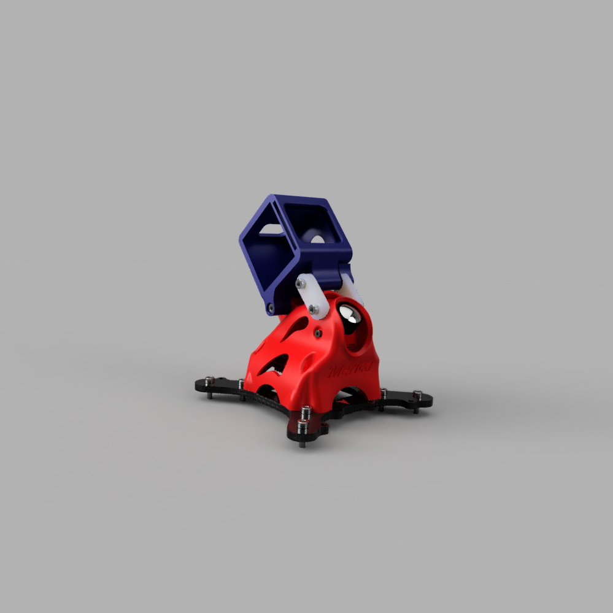
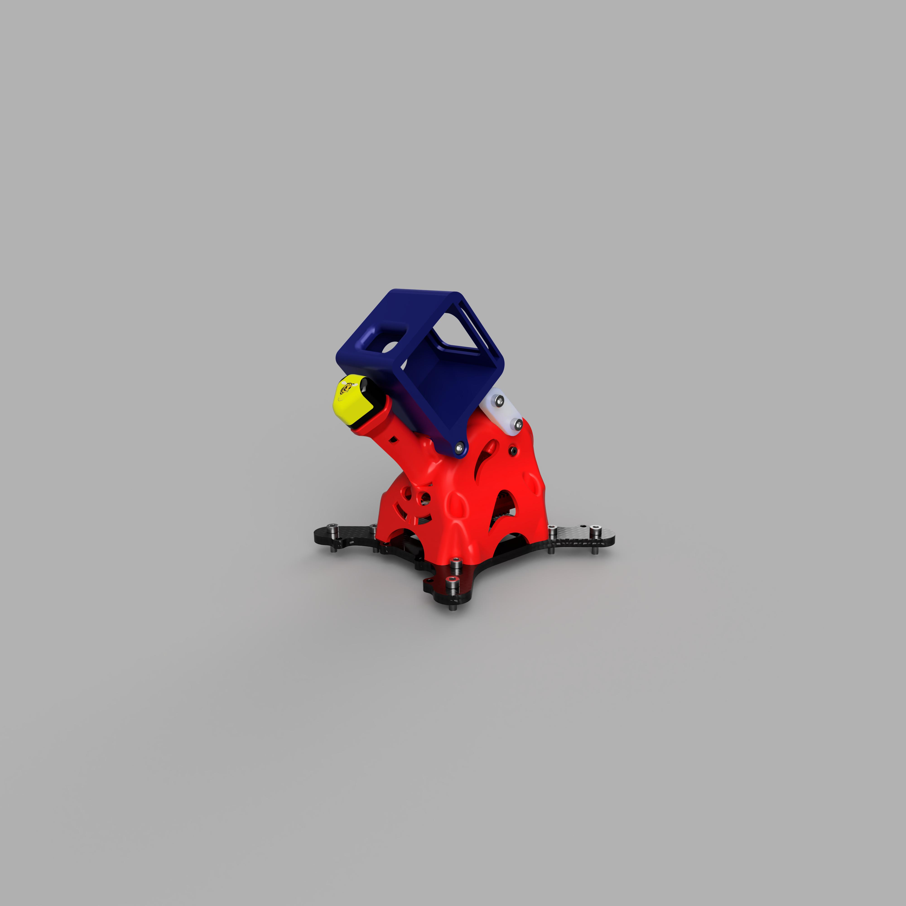

# Canopy for the CMW Macro Merica and HDZero Freestlye VTX

TPU 3D Printed Canopy for the CMW Macro Merica using the HDZero Freestyle VTX
Designed around the Speedy Bee UFL mount RHCP Antenna
Accomodates 19mm wide cameras (HDZero Micro v2 or Foxeer Digisight V3)

STLs for slicer generated supports or for designed in supports (recommended)

BOM:
* (4) M3x12 SHCS (replaces the M3x10 SHCS that the stock canopy uses)
* (6) M3x10 SHCS or BHCS for RunCam 5 Mount
* (1) M3x25 Standoff
* (1) M3x14 Standoff (trim an M3x15 or M3x20 to length)
* (4) Aluminum inserts from the stock canopy
* (2) M2x5 SHCS or BHCS for FPV Camera Mounting

