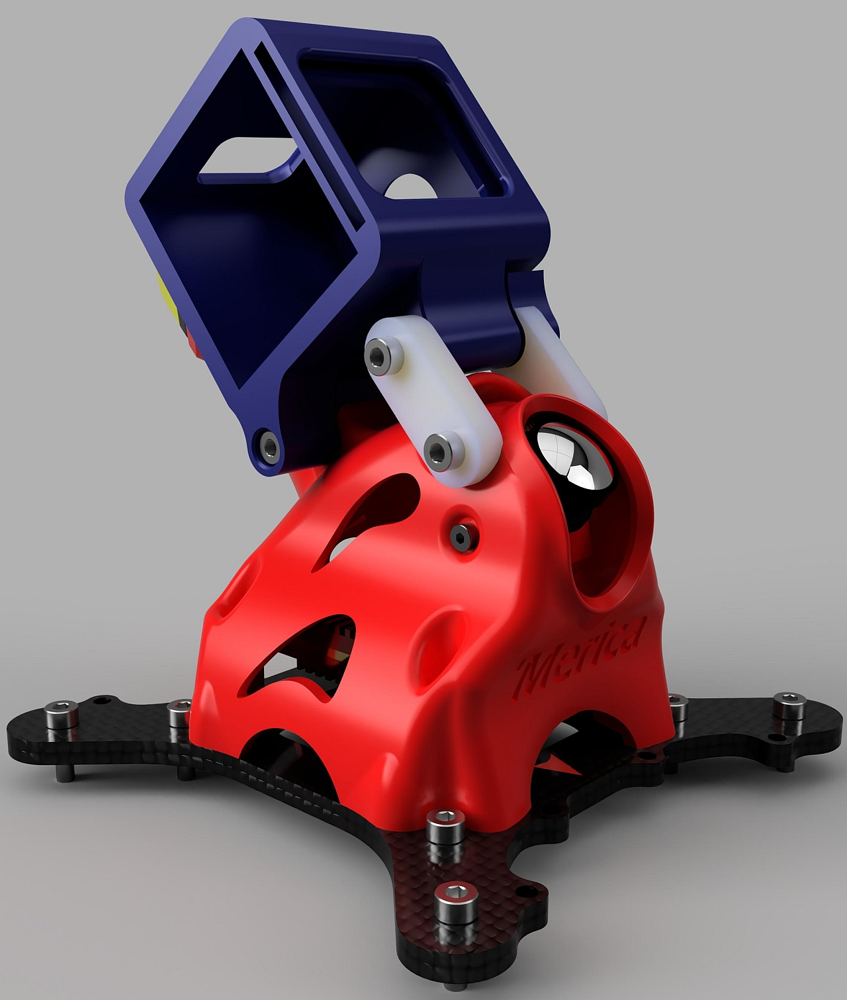
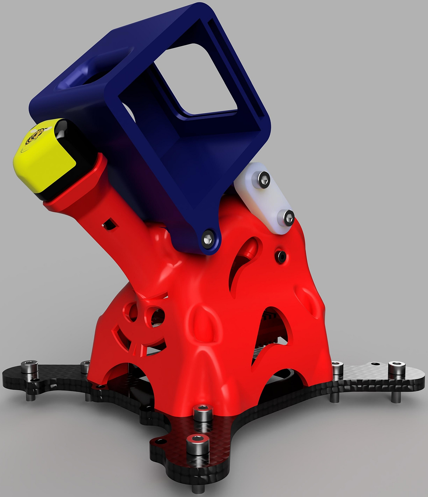

# Canopy for the CMW Macro Merica and HDZero Freestlye VTX

FDM Canopy for the CMW Macro Merica using the HDZero Freestyle VTX
Designed around the Speedy Bee UFL mount RHCP Antenna
Accomodates 19mm wide cameras (HDZero Micro v2 or Foxeer Digisight V3)

STLs for slicer generated supports (messy and wasteful) or for designed in supports (recommended)

RunCam5 Mount Supports Camera Butter or TBS Jello Guard Slip In ND Filters

BOM:
* (4) M3x12 SHCS (replaces the M3x10 SHCS that the stock canopy uses)
* (4) M3x5x4 Heatset Inserts (VTX Anchors)
* (4) M3x8 BHCS for VTX Mounting
* (2) M2x5 SHCS or BHCS for FPV Camera Mounting
* (4) Aluminum inserts from the stock canopy

BOM for Action Camera Mount:
* (6) M3x10 SHCS or BHCS
* (1) M3x25 Standoff
* (1) M3x14 Standoff (trim an M3x15 or M3x20 to length)

Tips:
I've printed this and the development versions in TPU with a 0.4mm nozzle and 0.2mm layer height.

I prefer Ninjatek Cheetah filament and a nice slow speed for best quality.

Holes for the heat set inserts are tapered and take a good amount of pressure and heat to get them set.

Other antennas can be used if desired. Either clip the model in your slicer to remove the triangular boss, or just cut off the extra material.

Step file is included if you wish to revise to your hardware choices.

Slot provided in the antenna tube for extra means of securing the antenna with a cable tie - why chance it with this VTX right?

Camera angle is fixed at 40° but the couplers can be revised for lower angles. 40° is pretty much the max before interference with the antenna tube.

